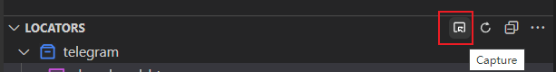
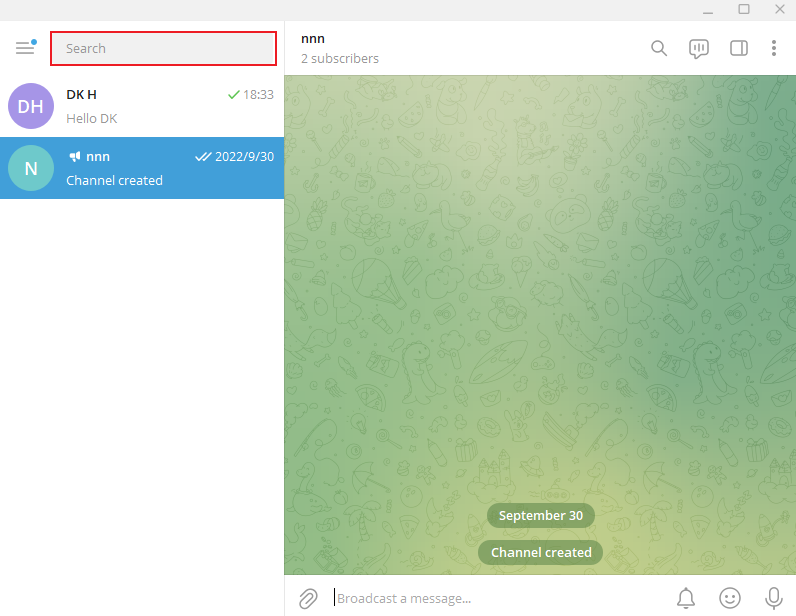
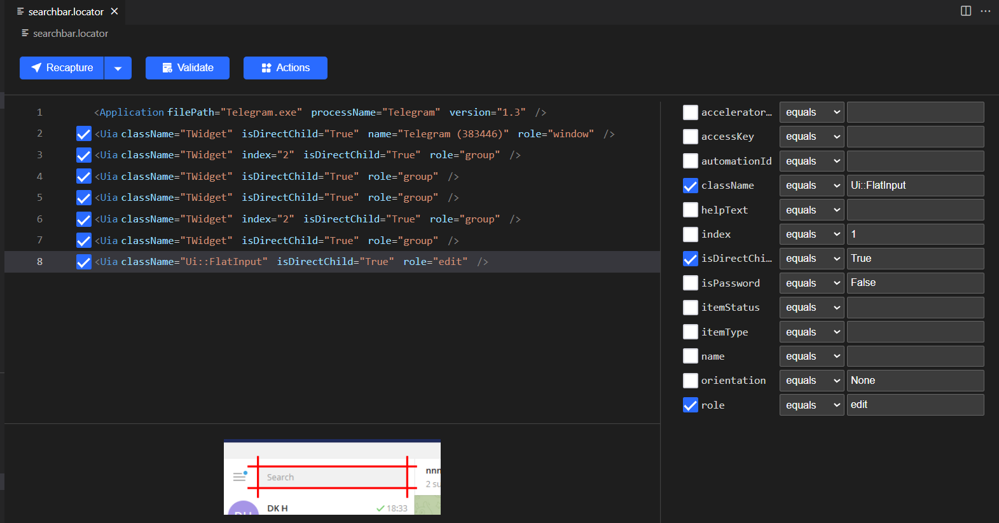
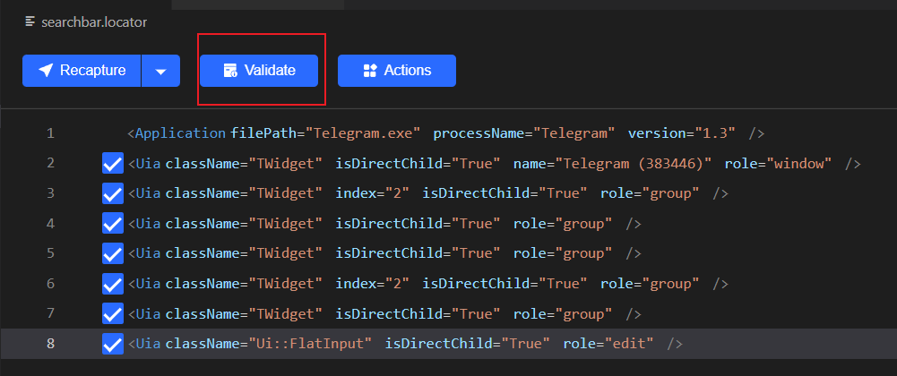
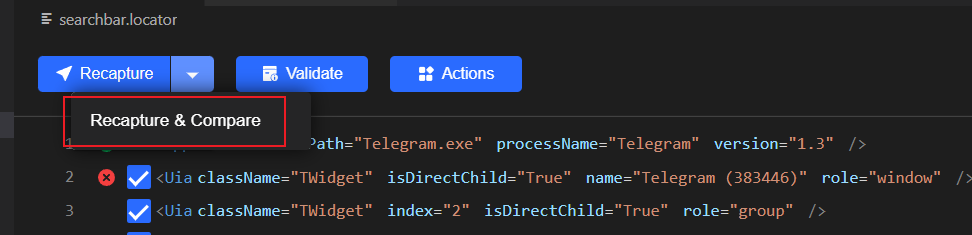
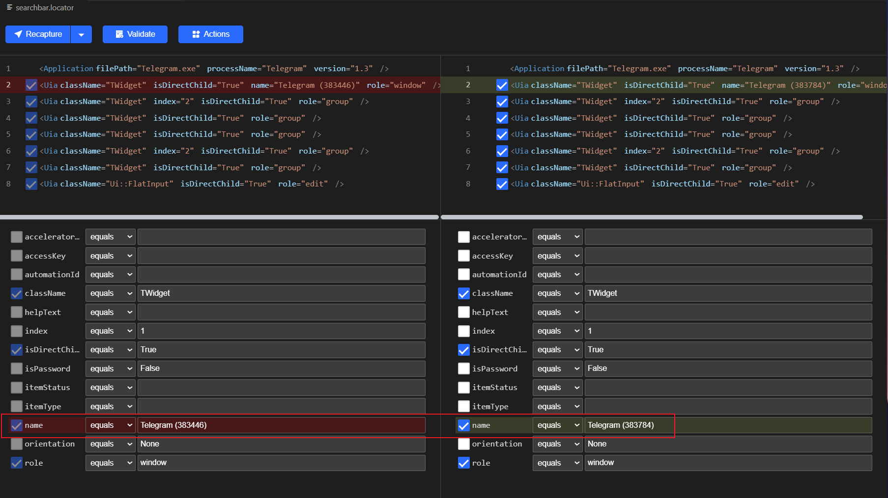

# Telegram Automation
## Overview
It is a sample of using Python code to control the Telegram client and send messages to contacts and the Telegram channel. 

## Step by Step 
1. Set up Clicknium 
    - Install VS Code Clicknium [Extension](https://marketplace.visualstudio.com/items?itemName=ClickCorp.clicknium)
    - Use the extension to install Clicknium Python [SDK](https://pypi.org/project/clicknium/)

2. Log in to your Telegram client.

3. Capture the search bar  
    - Click `Capture` button  
      <!-- #(https://s1.328888.xyz/2022/10/08/fW1Rm.png) -->
    - Use `Ctrl + Click` to capture search bar   
       
    <!-- https://s1.328888.xyz/2022/10/08/fWKVk.png -->
    - Get the search bar locator  
      
    <!-- https://s1.328888.xyz/2022/10/08/fWcpE.png -->
    - Validate the locator  
    
    <!-- https://s1.328888.xyz/2022/10/08/fW2FJ.png -->
    The validation would be failed. The most simple way to debug this issue, we can use a new feature provided by Clicknium: `Recapture & Compare`
     
    <!-- https://s1.328888.xyz/2022/10/08/fWJpo.png  -->
    After recapturing the search bar, we can get the compared model to check the difference between the old and new. 
      
    <!-- https://s1.328888.xyz/2022/10/08/fWyOF.png -->
    It's easy to get the difference between the old and new is the `name` attribute. There is a number that follows the word "Telegram."
    We can use the [wildcard](https://www.clicknium.com/documents/concepts/locator#wildcard-locator) to fix it by changing the number `383784` to `*` and saving the locator. 
    Validate again, and it will succeed. 

4. Set text into the search bar
- Include the Clicknium package into your Python code and set the contacts name into the search bar using Clicknium API.
```Python
from clicknium import clicknium as cc, locator

cc.find_element(locator.telegram.contact_search).set_text("DK H")
``` 

5. Select the contacts by pressing the `Enter` key. 
More codes of the key can be found at [the page](https://learn.microsoft.com/en-au/dotnet/api/system.windows.forms.sendkeys?view=windowsdesktop-6.0#remarks) 
```
    cc.send_hotkey("{ENTER}")
``` 

6. Capture the message text input and send messages button using the same way as step 3. 
7. Code the workflow into Python. You can check the sample in the sample.py file. 

    